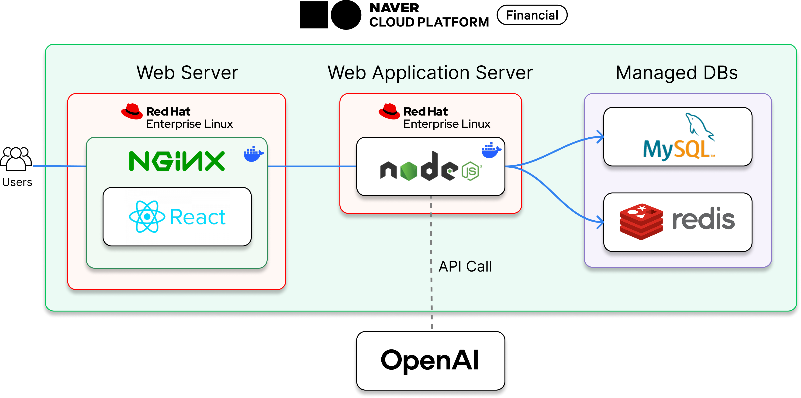
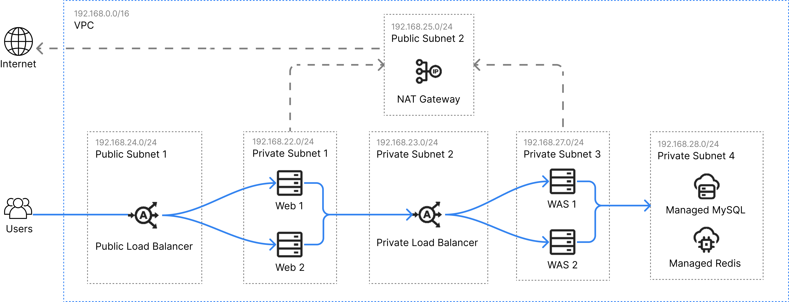
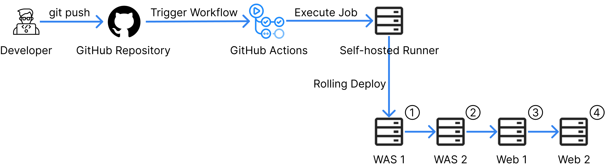

# Kospay

> 마이데이터 소비 분석을 실천 가능한 절약 행동으로 연결하는 AI 금융 코칭 서비스

[](https://react.dev/)
[](https://vite.dev/)
[](https://expressjs.com/)
[](https://www.mysql.com/)
[](https://redis.io/)
[](https://www.docker.com/)

## 목차

- [프로젝트 소개](#프로젝트-소개)
- [팀원](#팀원)
- [핵심 가치](#핵심-가치)
- [주요 기능](#주요-기능)
- [AI 활용](#ai-활용)
- [서비스 및 시스템 아키텍처](#서비스-및-시스템-아키텍처)
- [기술 스택](#기술-스택)
- [프로젝트 구조](#프로젝트-구조)
- [인프라 구성](#인프라-구성)
- [CI/CD](#cicd)
- [로컬 실행](#로컬-실행)
- [주요 API](#주요-api)
- [검증](#검증)
- [관련 문서](#관련-문서)

## 프로젝트 소개

기존 가계부 서비스는 사용자가 **어디에 얼마를 썼는지** 보여주는 데 집중합니다. 하지만 소비 내역을 확인하는 것만으로 실제 절약 행동까지 이어지기는 어렵습니다.

Kospay는 다음 흐름을 하나의 서비스로 연결합니다.

```text
마이데이터 연동
→ 소비 패턴 분석
→ AI 소비 DNA 및 절약 코칭
→ 개인화 주간 챌린지
→ 거래내역 기반 자동 검증
→ 포인트·익명 랭킹
→ 절약 금액의 투자효과 확인
```

단순한 소비 기록을 넘어, 사용자가 바로 실행할 수 있는 작은 절약 행동을 제안하고 실제 달성 여부까지 확인하는 것이 Kospay의 목표입니다.

### 프로젝트 정보

| 항목        | 내용                                                                |
| ----------- | ------------------------------------------------------------------- |
| 프로젝트    | Kospay                                                              |
| 구분        | 미니프로젝트 2조                                                    |
| 형태        | 모바일 우선 반응형 웹 서비스                                        |
| 저장소      | [github.com/up2moon/kopilot](https://github.com/up2moon/kopilot)    |
| 핵심 키워드 | MyData, AI Coaching, Challenge, Gamification, Investment Simulation |

> **MVP 범위:** 현재 마이데이터 연동은 실제 금융기관 전송요구 API 대신 OpenAI 합성 거래 또는 고정 Fixture로 결제내역을 생성합니다. 실제 서비스에서는 사용자 동의를 거친 금융 마이데이터 API로 대체하는 구조를 가정합니다.

## 팀원

| 이름 | 역할 및 담당 기능 |
| --- | --- |
| 문지환 | Naver Cloud 인프라 구성, UI 디자인, 랭킹 리팩터링 |
| 이진원 | 프론트엔드 UI 디자인, 로그인·마이데이터 연동·투자효과 페이지 개발 |
| 김태영 | 기획서·발표 자료 제작, 마이페이지 개발, 챌린지 리팩터링 |
| 김유경 | AI 챗봇 개발, UI 디자인 및 리팩터링 |
| 조경진 | 챌린지 개발, UI 디자인 |
| 황성헌 | 대시보드·내 소비 상세·랭킹 개발 |

## 핵심 가치

### 1. 분석에서 행동으로

카테고리별 소비 금액을 보여주는 데서 끝나지 않고, 실제 거래 패턴을 바탕으로 이번 주에 수행할 수 있는 절약 챌린지를 생성합니다.

### 2. AI 결과의 근거 제공

금액, 횟수, 평균 결제액 같은 사실은 서버가 거래내역으로 계산합니다. OpenAI는 계산된 사실을 바탕으로 친근한 소비 DNA, 코칭 문구, 챌린지 설명을 생성합니다.

### 3. 자동 검증과 지속 동기

사용자가 영수증이나 사진을 제출하지 않아도 마이데이터 거래내역으로 챌린지 결과를 검증합니다. 성공 결과는 포인트와 익명 랭킹에 반영됩니다.

### 4. 절약의 기회비용 시각화

절약하거나 소비한 금액을 시장지수 ETF, 사용자가 선택한 종목, 정기예금/CMA에 배분했다고 가정해 현재 가치를 비교합니다. 투자 권유가 아닌 소비의 기회비용을 이해하기 위한 참고용 기능입니다.

## 주요 기능

### 마이데이터 온보딩

- 테스트 계정 자동 생성 및 로그인
- 마이데이터 연결 상태 관리
- 결제내역 수집 및 소비 카테고리 분류
- 관리할 소비 카테고리와 월 예산 목표 설정
- 최초 연결과 재연결 과정의 진행 애니메이션

### 소비 대시보드

- 이번 달 총소비, 전월 대비 변화, 결제 건수 요약
- AI 절약 코치의 핵심 메시지 제공
- 카테고리별 소비, 소비 추이, 최근 거래 상세 조회

### 소비 DNA

- 월별 소비내역을 기반으로 소비 성향 분석
- `커피 전문가`, `주말 미식 탐험가`처럼 친근한 별명 생성
- 실속형↔경험형, 계획형↔즉흥형 등 4개 소비 성향 축 제공
- 월별 분석 결과 저장 및 재사용
- 익명 랭킹에 소비 DNA 별명 표시

### AI 절약 코치

- 최근 소비와 예산을 반영한 개인화 코칭
- 코칭 맥락에 맞는 추천 질문 제공
- 소비·절약 범위 밖 질문을 제한하는 Guardrail
- 검수된 절약 지식을 활용하는 OpenAI File Search 기반 RAG
- 챗봇에서 주간 챌린지를 추가하고 챌린지 화면으로 연결

### AI 주간 챌린지

- 최근 소비 패턴을 기반으로 달성 가능한 주간 챌린지 생성
- `MAX_COUNT`, `MAX_SPEND`, `NO_SPEND` 등 거래내역으로 판정 가능한 챌린지 사용
- 난이도별 포인트 제공
- 거래내역 기반 일괄 인증
- 성공 결과와 컨페티 피드백 제공

### 익명 랭킹

- 실명 대신 자동 생성된 익명 닉네임과 아바타 사용
- 챌린지 포인트와 절약 성과 기반 순위 제공
- 내 순위와 상위 사용자 목록 제공
- 소비 DNA 별명을 함께 표시해 게임화 경험 강화

### 투자효과

- 선택 연월과 소비 카테고리 기준 투자 기회비용 계산
- S&P500 ETF, KOSPI 200 ETF, 정기예금/CMA 기본 비교
- 코스콤 CHECK API 기반 국내 주식·ETF 검색 및 시세 조회
- 종목 선택 시 기준일 가격과 현재가를 이용해 평가금액·손익률 계산
- 재계산 중에도 화면과 스크롤 상태 유지

<!--
## 서비스 화면

아래 경로에 이미지를 추가한 뒤 주석을 해제하세요.


권장 구성: 로그인 → 마이데이터 연동 → 대시보드 → 소비 DNA → 챌린지 → 투자효과
-->

## AI 활용

Kospay는 AI에 모든 판단을 맡기지 않습니다. **사실 계산은 서버**, **개인화된 표현과 행동 제안은 AI**가 담당하도록 역할을 분리했습니다.

| 기능             | 서버가 담당하는 사실 계산                     | OpenAI가 담당하는 생성              |
| ---------------- | --------------------------------------------- | ----------------------------------- |
| 소비 DNA         | 월별 카테고리 금액·비율·빈도·주요 가맹점      | 별명, 요약, 4개 성향 축             |
| 절약 코치        | 최근 거래·예산·카테고리 통계 구성             | 현실적인 절약 조언과 추천 질문      |
| 주간 챌린지      | 기준 소비, 목표 금액·횟수, 난이도·포인트 결정 | 친근한 챌린지 제목과 설명             |
| 챗봇             | 사용자별 소비 통계와 대화 문맥 구성           | RAG 기반 개인화 응답                |
| 개발용 거래 생성 | 허용 카테고리와 저장 형식 검증                | 실제 개인정보가 아닌 합성 거래 생성 |

### 프롬프트 설계 원칙

- 제공된 사용자 사실에 없는 거래, 금액, 횟수, 가맹점을 만들지 않습니다.
- 사용자를 비난하거나 소비의 전면 중단을 권하지 않습니다.
- 계산된 목표와 금액을 AI가 임의로 변경하지 못하게 합니다.
- 소비와 절약 범위를 벗어난 요청은 정해진 안내로 제한합니다.
- JSON Schema 기반 Structured Outputs으로 응답 구조를 고정합니다.
- 개인 거래 원문은 Vector Store에 저장하지 않고, 서버에서 집계한 통계만 문맥으로 전달합니다.
- Vector Store에는 `backend/knowledge/saving/`의 검수된 일반 절약 지식만 저장합니다.

## 서비스 및 시스템 아키텍처

Kospay는 React와 Nginx로 구성된 Web 계층, Node.js와 Express 기반의 WAS 계층, MySQL·Redis 데이터 계층으로 구성됩니다. WAS는 OpenAI API와 연동해 소비 DNA, 절약 코칭, 주간 챌린지를 생성합니다.



### 데이터 저장 구분

| 저장소              | 주요 데이터                                                      |
| ------------------- | ---------------------------------------------------------------- |
| MySQL               | 사용자, 거래내역, 예산, 소비 DNA, 챌린지, 포인트, 투자 종목·가격 |
| Redis               | Refresh Token, AI 챗봇 최근 대화, 캐시                           |
| OpenAI Vector Store | 검수된 일반 절약 지식                                            |

## 기술 스택

| 영역            | 기술                                                                |
| --------------- | ------------------------------------------------------------------- |
| Frontend        | React 19, Vite 8, JavaScript ES Modules, CSS                        |
| Backend         | Node.js, Express 5, Sequelize 6                                     |
| Database        | MySQL 8.4                                                           |
| Cache / Session | Redis 7                                                             |
| AI              | OpenAI Responses API, Structured Outputs, Vector Store, File Search |
| External API    | 코스콤 CHECK API                                                    |
| Authentication  | JWT Access Token, Redis Refresh Token                               |
| Web Server      | Nginx                                                               |
| Infra           | Naver Cloud Platform, VPC, Load Balancer, NAT Gateway               |
| Container       | Docker, Docker Compose                                              |
| CI/CD           | GitHub Actions, Self-hosted Runner, Rolling Deployment              |
| Quality         | Oxlint, Vite Build, Node.js Test Runner                             |

## 프로젝트 구조

```text
kopilot/
├── frontend/                         # React + Vite 클라이언트
│   ├── public/                       # 정적 리소스
│   └── src/
│       ├── assets/                   # 이미지와 아이콘
│       ├── components/               # 공통 UI 컴포넌트
│       ├── pages/                    # 화면별 컴포넌트·훅·스타일
│       └── services/                 # 백엔드 API 클라이언트
├── backend/                          # Express API 서버
│   ├── data/                         # 개발·검증용 데이터
│   ├── knowledge/saving/             # RAG 절약 지식 문서
│   ├── scripts/                      # Vector Store 생성 및 운영 스크립트
│   └── src/
│       ├── middleware/               # 인증 미들웨어
│       ├── models/                   # Sequelize 모델
│       ├── routes/                   # REST API 라우터
│       └── services/                 # AI·랭킹·챌린지·투자 로직
├── kopilot-design/                   # PRD, 디자인 및 기능 명세
├── .github/workflows/deploy.yml      # 운영 롤링 배포
├── compose.yml                       # 운영 Web/WAS 프로필
├── compose.dev.yml                   # 로컬 통합 개발 환경
├── INFRA.md                          # 인프라 상세 문서
└── README.md
```

## 인프라 구성

운영 환경은 Naver Cloud Platform의 VPC 내부에 Web 계층과 WAS 계층을 분리한 3계층 구조로 구성합니다.



> 아키텍처 이미지는 서비스 요청 흐름 중심으로 단순화했으며, 운영 접근 구성은 생략했습니다.

### 네트워크 구성

| 구분             | CIDR              | 주요 리소스                  |
| ---------------- | ----------------- | ---------------------------- |
| VPC              | `192.168.0.0/16`  | 전체 서비스 네트워크         |
| Public Subnet 1  | `192.168.24.0/24` | Public Load Balancer         |
| Public Subnet 2  | `192.168.25.0/24` | NAT Gateway                  |
| Private Subnet 1 | `192.168.22.0/24` | Web 1, Web 2                 |
| Private Subnet 2 | `192.168.23.0/24` | Private Load Balancer        |
| Private Subnet 3 | `192.168.27.0/24` | WAS 1, WAS 2                 |
| Private Subnet 4 | `192.168.28.0/24` | Managed MySQL, Managed Redis |

### 요청 흐름

```text
사용자
→ Public Load Balancer
→ Web Server (Nginx)
→ Private Load Balancer
→ WAS (Express)
→ Managed MySQL / Managed Redis / External API
```

## CI/CD

`main` 브랜치 push 또는 GitHub Actions 수동 실행 시 운영 롤링 배포가 시작됩니다.



### 배포 특징

1. GitHub Actions의 NCP 서버별 Self-hosted Runner에서 실행합니다.
2. 배포 대상을 Load Balancer Target Group에서 먼저 제거합니다.
3. `/opt/kopilot`의 소스를 배포 커밋으로 동기화합니다.
4. Docker Compose로 해당 Web 또는 WAS 컨테이너만 재빌드합니다.
5. Web은 `/health`, WAS는 `/api/health`로 로컬 헬스체크를 수행합니다.
6. 정상 응답을 확인한 서버만 Load Balancer에 다시 등록합니다.
7. WAS 1 → WAS 2 → Web 1 → Web 2 순서로 배포해 서비스 중단을 줄입니다.
8. 동일 배포가 겹치지 않도록 GitHub Actions concurrency를 적용합니다.

### 배포 환경변수와 Secret

운영 인증정보는 GitHub Secrets 또는 서버 환경변수로 주입하며 저장소에 커밋하지 않습니다.

- NCP Region 및 Target Group/Target 번호
- `JWT_SECRET`
- `OPEN_AI_KEY`
- `OPENAI_SAVING_VECTOR_STORE_ID`
- `CUST_ID`, `AUTH_KEY`
- DB 및 Redis 연결 정보

## 로컬 실행

### 사전 요구사항

- Node.js 20.19 이상 또는 22.12 이상
- npm
- Docker 및 Docker Compose

### 1. 저장소 복제

```bash
git clone https://github.com/up2moon/kopilot.git
cd kopilot
```

### 2. 환경변수 설정

루트에 `.env` 파일을 생성합니다.

```dotenv
DB_NAME=kopilot
DB_USER=kopilot
DB_PASSWORD=change-me
MYSQL_ROOT_PASSWORD=change-root-password

JWT_SECRET=change-local-jwt-secret

# 실제 OpenAI 연동 시 설정
OPEN_AI_KEY=
OPENAI_MODEL=gpt-4.1-mini
OPENAI_SAVING_VECTOR_STORE_ID=

# 로컬 고정 거래 데이터 사용 시 fixture로 설정
MYDATA_TRANSACTION_SOURCE=fixture

# 로컬에서는 기본적으로 코스콤 호출을 비활성화
CHECK_API_ENABLED=false
CUST_ID=
AUTH_KEY=
```

> `.env`와 실제 인증키는 Git에 커밋하지 마세요.

### 3. Docker Compose 통합 실행

```bash
docker compose -f compose.dev.yml up --build
```

| 서비스   | 주소                    |
| -------- | ----------------------- |
| Frontend | `http://localhost:5173` |
| Backend  | `http://localhost:3001` |
| MySQL    | `localhost:3307`        |
| Redis    | `localhost:6379`        |

### 4. OpenAI 절약 지식 저장소 생성

```bash
cd backend
npm run knowledge:create
```

출력된 Vector Store ID를 `OPENAI_SAVING_VECTOR_STORE_ID`로 설정합니다.

## 주요 API

### 인증·온보딩

| Method | Endpoint                          | 설명                         |
| ------ | --------------------------------- | ---------------------------- |
| POST   | `/api/auth/signup`                | 회원가입 및 토큰 발급        |
| POST   | `/api/auth/login`                 | 로그인                       |
| POST   | `/api/auth/refresh`               | 토큰 재발급                  |
| POST   | `/api/auth/logout`                | Refresh Token 폐기           |
| GET    | `/api/users/me/onboarding-status` | 온보딩 상태 조회             |
| POST   | `/api/users/me/mydata/connect`    | 마이데이터 연결 및 거래 저장 |
| POST   | `/api/users/me/mydata/disconnect` | 마이데이터 연결 해제         |
| POST   | `/api/users/me/budgets`           | 카테고리별 월 예산 저장      |

### 소비·AI

| Method | Endpoint                                | 설명                    |
| ------ | --------------------------------------- | ----------------------- |
| GET    | `/api/users/me/spending/summary`        | 월별 소비 요약          |
| GET    | `/api/users/me/spending/transactions`   | 소비내역 페이징 조회    |
| GET    | `/api/users/me/consumption-dna`         | 월별 소비 DNA 생성·조회 |
| GET    | `/api/users/me/saving-bot/coaching`     | AI 절약 코칭 조회       |
| POST   | `/api/users/me/saving-bot/chat`         | RAG 기반 AI 챗봇        |
| GET    | `/api/users/me/saving-bot/chat/history` | 최근 챗봇 대화 조회     |

### 챌린지·랭킹·투자

| Method | Endpoint                                     | 설명                      |
| ------ | -------------------------------------------- | ------------------------- |
| GET    | `/api/users/me/challenges`                   | 주간 챌린지 조회·생성     |
| POST   | `/api/users/me/challenges/verify`            | 주간 챌린지 일괄 검증     |
| GET    | `/api/users/me/ranking`                      | 내 익명 랭킹              |
| GET    | `/api/users/ranking/top`                     | 상위 랭킹 목록            |
| GET    | `/api/users/me/investment-effect/simulation` | 투자효과 시뮬레이션       |
| GET    | `/api/investment/assets/search`              | 주식·ETF 목록 및 검색     |
| GET    | `/api/investment/quotes`                     | 저장 시세 조회            |
| POST   | `/api/investment/sync`                       | 코스콤 데이터 수동 동기화 |

## 검증

```bash
# Frontend lint
cd frontend
npm run lint
```

```bash
# Frontend production build
cd frontend
npm run build
```

```bash
# Backend unit test
cd backend
npm test
```

```bash
# Backend health check
curl http://localhost:3001/api/health
curl http://localhost:3001/api/hello
```

현재 자동화 테스트는 Node.js 내장 테스트 러너로 일부 백엔드 응답 계약을 검증합니다. UI 변경은 lint와 production build를 기본 검증 기준으로 사용합니다.

## 보안 및 개인정보

- Access Token과 Refresh Token을 분리합니다.
- Refresh Token 원문 대신 SHA-256 해시를 Redis에 저장합니다.
- 사용자별 거래·예산·대화 데이터는 `user_id`로 분리합니다.
- 개인 거래 원문은 OpenAI Vector Store에 업로드하지 않습니다.
- OpenAI, 코스콤, DB 인증정보는 환경변수로 주입합니다.
- 운영 서버와 데이터베이스는 Private Subnet에 배치합니다.
- 외부 사용자는 Public Load Balancer를 통해서만 접근합니다.

## 관련 문서

| 문서                                                               | 설명                             |
| ------------------------------------------------------------------ | -------------------------------- |
| [`frontend/FRONT.md`](./frontend/FRONT.md)                         | 프론트엔드 화면·라우팅·구현 기준 |
| [`backend/BACK.md`](./backend/BACK.md)                             | API·AI·데이터 구조               |
| [`INFRA.md`](./INFRA.md)                                           | NCP 네트워크·서버·배포 상세      |
| [`kopilot-design/PRD.md`](./kopilot-design/PRD.md)                 | 제품 요구사항                    |
| [`kopilot-design/DESIGN.md`](./kopilot-design/DESIGN.md)           | 디자인 가이드와 Figma 링크       |
| [`kopilot-design/docs/features/`](./kopilot-design/docs/features/) | 기능별 상세 명세                 |

---

미니프로젝트 2조 · Kospay
